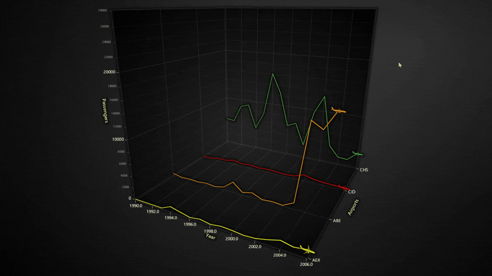

# **Air Traffic Data Visualization with LightningChart Python**

## **Air Traffic Data Visualization**
### **What is it and its Importance for Monitoring Air Traffic Data**
Air traffic data visualization is the process of graphically representing flight-related information, such as routes, passenger counts, and flight frequencies. This process is critical for monitoring air traffic in real-time, identifying trends, and improving operational efficiency. By using visual tools, aviation stakeholders—such as air traffic controllers, airport managers, and airline operators—can quickly interpret large datasets and make data-driven decisions.

### **Key Sources of Air Traffic Data**
1. **GPS and ADS-B Systems**: Aircraft transmit real-time data on position, altitude, and speed.  
2. **Radar Systems**: Ground-based radar tracks aircraft movement within controlled airspace.  
3. **Airline Reports**: Airlines submit passenger counts, flight schedules, and delays.  
4. **Flight Tracking APIs**: Public and commercial APIs like FlightAware and OpenSky provide live flight data for analysis.  
5. **Government Aviation Reports**: Statistical data compiled by agencies like the U.S. Department of Transportation (DOT).

---

## **Benefits of Air Traffic Data Visualization**
### **Improved Traffic Management**
Visualization tools help identify air traffic congestion and allow real-time adjustments to improve flow and reduce delays.

### **Optimized Route Planning**
Analyzing flight routes and traffic trends helps airlines optimize paths to save fuel, reduce costs, and improve punctuality.

### **Data-Driven Air Traffic Planning**
Airports and aviation authorities can use historical and real-time data to enhance runway allocation, manage peak hours, and plan for future expansions.

---

## **LightningChart Python**
### **Overview of LightningChart Python**
LightningChart Python is a high-performance data visualization library designed to handle large datasets with minimal latency. It provides fast rendering capabilities, interactive features, and a diverse range of chart types, making it ideal for visualizing air traffic data.

### **Features and Chart Types to Be Used in the Project**
In this project, we leverage several LightningChart features to create powerful and interactive air traffic visualizations:
- **Line Charts**: Visualize trends in flight and passenger data over time.  
- **Bar Charts**: Compare top foreign destinations and flight types.  
- **Pie Charts**: Analyze regional flight distributions.  
- **Heatmaps**: Identify seasonal trends in passenger traffic.  
- **3D Line Charts**: Show passenger traffic across airports over the years.  
- **Map Charts**: Display global airline routes and flight intensity.  
- **Bubble Charts**: Represent flight volume and passenger density with variable-sized bubbles.  
- **Polar Charts**: Visualize cyclic patterns, such as monthly passenger distribution, using angular coordinates.  
- **Radar Charts**: Compare multiple metrics, like scheduled and charter flights, across various airports or months.

### **Performance Characteristics**
- **High-Performance Rendering**: Handles millions of data points efficiently.  
- **Real-Time Updates**: Smooth visualization for live air traffic monitoring.  
- **Interactive Features**: Zooming, panning, and tooltips improve user experience.  
- **Customizability**: Fully customizable charts to suit specific use cases.

---

## **Setting Up Python Environment**
### **Installing Python and Necessary Libraries**
Install Python and the required libraries with the following command:
```bash
pip install pandas numpy lightningchart scipy trimesh
```

### **Overview of Libraries Used**
- **Pandas**: For efficient data manipulation and analysis.  
- **NumPy**: Provides tools for numerical operations and data scaling.  
- **LightningChart**: Enables high-performance, interactive data visualization.  
- **Trimesh**: Handles 3D objects and mesh rendering.

### **Setting Up Your Development Environment**
Set up a virtual environment to manage dependencies and avoid conflicts:
```bash
python -m venv venv
source venv/bin/activate  # On Windows: venv\Scripts\activate
```
For coding, **Visual Studio Code** is recommended for its robust debugging and extensions.

---

## **Loading and Processing Data**
### **How to Load the Data Files**
Load the air traffic data using Pandas:
```python
import pandas as pd

data = pd.read_excel("air_traffic_data.xlsx")
data_bar = pd.read_csv("air traffic.csv")
```

### **Handling and Preprocessing the Data**
- **Clean the Data**: Remove null values and incorrect entries.  
- **Aggregate Data**: Group data by year, month, or airport:
```python
monthly_trends = data.groupby(['Year', 'Month'])[['Total_Flights', 'Total_Passengers']].sum().reset_index()
```
- **Normalize Data**: Apply logarithmic scaling to handle large variations:
```python
import numpy as np
monthly_trends['Log_Total_Flights'] = np.log1p(monthly_trends['Total_Flights'])
```

---

## **Visualizing Data with LightningChart**
### **Introduction to LightningChart for Python**
LightningChart Python simplifies complex air traffic data into clear and interactive visuals. Its real-time capabilities and advanced charting options are ideal for analyzing and presenting large datasets effectively.

---

## **1. Monthly Trends: Flights and Passengers (Logarithmic Normalization)**

### **Description:**  
This chart visualizes the monthly trends of total flights and passengers over time, using a logarithmic normalization to handle large variations in the data. Two line series are plotted:  
- **Log Total Flights**: Represents flight volume trends.  
- **Log Total Passengers**: Reflects passenger trends.

### **Results:**  
- The chart shows a steady increase in flight volume over time.  
- Passenger volumes display cyclical peaks, particularly during specific months, indicating strong seasonal patterns (e.g., summer travel).  
- The logarithmic scale reduces extreme value distortions and highlights relative changes over time.

### **Use Cases:**  
- **Seasonal Trend Analysis**: Identify months with increased passenger demand.  
- **Growth Monitoring**: Track long-term trends in air traffic.  
- **Operational Planning**: Airlines can schedule more flights during peak months.

### **Script Summary:**
```python
# Group by Year and Month and calculate the total flights and passengers
monthly_trends = data.groupby(['Year', 'Month'])[['Total_Flights', 'Total_Passengers']].sum().reset_index()
monthly_trends['Log_Total_Flights'] = np.log1p(monthly_trends['Total_Flights'])
monthly_trends['Log_Total_Passengers'] = np.log1p(monthly_trends['Total_Passengers'])

# Create Line Chart
chart = lc.ChartXY().set_title('Monthly Trends: Flights and Passengers (Logarithmic Normalization)')
chart.add_point_line_series().add(x=np.arange(len(monthly_trends)), y=monthly_trends['Log_Total_Flights'])
chart.add_point_line_series().add(x=np.arange(len(monthly_trends)), y=monthly_trends['Log_Total_Passengers'])
chart.open(method="browser")
```

---

## **2. Top 10 Foreign Destinations and Flight Types**

### **Description:**  
This bar chart ranks the top 10 busiest foreign destinations based on total passengers. Additionally, a smaller bar chart compares the flight types:  
- **Scheduled Flights** (major commercial flights).  
- **Charter Flights** (private or unscheduled flights).

### **Results:**  
- Airports like **LHR (London Heathrow)** and **YYZ (Toronto Pearson)** have the highest passenger volumes, indicating their importance as major international hubs.  
- Scheduled flights dominate air traffic, with charter flights contributing a very small proportion.

### **Use Cases:**  
- **Route Optimization**: Airlines can prioritize popular routes.  
- **Demand Analysis**: Identify destinations needing increased flight capacity.  
- **Operational Insights**: Compare flight types for strategic planning.

### **Script Summary:**
```python
# Aggregate passengers for top 10 destinations
foreign_destinations = data.groupby('fg_apt')['Total_Passengers'].sum().sort_values(ascending=False).head(10)
chart = lc.BarChart().set_title('Top 10 Foreign Destinations')
chart.set_data([{'category': apt, 'value': value} for apt, value in foreign_destinations.items()])
chart.open(method="browser")
```

---

## **3. Regional Distribution of Flights (Pie Chart)**

### **Description:**  
The pie chart divides total flights by region, showing how traffic is distributed across various global regions.

### **Results:**  
- Regions like **North America**, **Europe**, and **Asia** dominate air traffic, with North America contributing the largest share.  
- Smaller regions, like **Oceania** or **Africa**, show relatively lower traffic volumes.

### **Use Cases:**  
- **Market Analysis**: Determine regional demand for flights.  
- **Resource Allocation**: Focus operational resources on high-demand regions.  
- **Expansion Strategies**: Identify underserved regions for business opportunities.

### **Script Summary:**
```python
regions = data.groupby('Region')['Total_Flights'].sum()
chart = lc.PieChart().set_title('Regional Distribution of Flights')
chart.add_slices([{'name': r, 'value': v} for r, v in regions.items()])
chart.open(method="browser")
```

---

## **4. Seasonal Trends: Total Passengers (Heatmap)**

### **Description:**  
This heatmap visualizes passenger traffic over a range of years and months.  
- **X-axis**: Represents years.  
- **Y-axis**: Represents months.  
- **Color intensity** indicates the number of passengers, from **blue** (low) to **red** (high).

### **Results:**  
- Summer months (**June-August**) consistently show red zones, reflecting peak travel seasons.  
- A noticeable decline appears during events like the COVID-19 pandemic in 2020.

### **Use Cases:**  
- **Seasonality Insights**: Identify recurring travel patterns.  
- **Operational Optimization**: Schedule additional flights during peak seasons.  
- **Event Impact Analysis**: Evaluate disruptions like pandemics or global events.

### **Script Summary:**
```python
seasonal_trends = data.pivot_table(values='Total_Passengers', index='Year', columns='Month', aggfunc='sum')
heatmap_series = lc.ChartXY().add_heatmap_grid_series(columns=12, rows=seasonal_trends.shape[0])
heatmap_series.invalidate_intensity_values(seasonal_trends.to_numpy().tolist())
chart.open(method="browser")
```

---

## **5. Monthly Distribution of Passengers (Polar and Radar Chart)**

## **Description:**  
This dashboard consists of four visualizations aimed at analyzing air traffic trends, flight types, and carrier performance:

1. **Monthly Distribution of Total Passengers (Polar Chart):**  
   - Displays passenger volume cyclically across months in a circular format. The amplitude represents the total passengers for each month.

2. **Scheduled vs Charter Flights (Radar Chart):**  
   - Compares the normalized values of scheduled and charter flights across six major airports (**MSP, IAH, ATL, CLT, IAD, JFK**). Logarithmic normalization ensures balanced visualization of large and small values.

3. **Seasonal Trends: Flights vs Passengers (Radar Chart):**  
   - Shows the trends of **Total Flights** and **Total Passengers** over the 12 months, using a radar chart to highlight seasonal patterns with logarithmic scaling.

4. **Carrier Performance Comparison (Radar Chart):**  
   - Evaluates the performance of various airline carriers across three metrics:  
     - **Total Passengers**  
     - **Total Flights**  
     - **Charter Flights**  
   - The data is normalized using min-max scaling for comparability.

---

## **Results:**  
- **Monthly Passenger Trends (Polar Chart):**  
  - Passenger traffic peaks during **June, July, and August**, corresponding to summer vacations. Lower demand is observed in **January and February**.

- **Scheduled vs Charter Flights (Radar Chart):**  
  - Scheduled flights dominate all six airports, with only minor charter flight contributions at **MSP** and **IAH**.

- **Seasonal Trends: Flights vs Passengers (Radar Chart):**  
  - Both flights and passenger volumes peak during **summer (June–August)** and **December** due to holiday travel.  
  - The alignment between increased flights and passenger demand highlights the operational adjustments airlines make during peak months.

- **Carrier Performance Comparison (Radar Chart):**  
  - Significant variability exists across carriers for **Total Passengers**, **Total Flights**, and **Charter Flights**.  
  - Some carriers lead in specific metrics, while others underperform in charter or total flights.

---

## **Use Cases:**  
- **Seasonal Demand Analysis:**  
   - Identify peak travel months for better resource planning and scheduling additional flights during high-demand periods.  

- **Operational Insights for Flight Types:**  
   - Compare scheduled and charter flight contributions across airports to identify opportunities for expanding commercial or niche services.  

- **Performance Benchmarking for Airlines:**  
   - Evaluate airline carriers' performance across key metrics to determine operational strengths, weaknesses, and opportunities for improvement.  

- **Strategic Planning:**  
   - Use the insights from flight trends, passenger distribution, and carrier performance to optimize routes, allocate resources, and improve overall air traffic management.  

- **Resource Allocation:**  
   - Airports and airlines can allocate workforce, infrastructure, and fleet capacity based on identified passenger and flight trends.


### **Script Summary:**
```python
monthly_passengers = data.groupby('Month')['Total_Passengers'].sum()
chart = lc.PolarChart().set_title('Monthly Distribution of Total Passengers')
chart.add_point_series().set_data([{'angle': month * 30, 'amplitude': val} for month, val in monthly_passengers.items()])
chart.open(method="browser")
```
```python
flights = data.groupby('Airport')[['Scheduled_Flights', 'Charter_Flights']].sum()
chart = lc.SpiderChart().set_title('Scheduled vs Charter Flights')
for col in ['Scheduled_Flights', 'Charter_Flights']:
    chart.add_series().set_name(col).add_points(
        [{'axis': apt, 'value': val} for apt, val in flights[col].items()]
    )
chart.open(method="browser")
```

---

## **6. Passenger Traffic by Airport (3D Line Chart)**

### **Description:**  
This 3D line chart displays passenger traffic over the years for selected airports:  
- **X-axis**: Year.  
- **Y-axis**: Passenger count.  
- **Z-axis**: Airports.

### **Results:**  
- Passenger traffic at major airports (e.g., **CHS** and **CID**) shows spikes in certain years.  
- Clear patterns of growth, decline, or stagnation are visible across different airports.

### **Use Cases:**  
- **Airport Analysis**: Track growth trends in passenger volumes.  
- **Capacity Planning**: Identify airports needing infrastructure upgrades.  
- **Impact Assessment**: Evaluate the effect of events like the pandemic.

### **Script Summary:**
```python
passenger_data = data.groupby(['Year', 'Airport'])['Total_Passengers'].sum().reset_index()
chart = lc.Chart3D().set_title('Passenger Traffic by Airport')
chart.add_line_series().add(x=passenger_data['Year'], y=passenger_data['Total_Passengers'], z=passenger_data['Airport'])
chart.open(method="browser")
```

---

## **7. Flight Intensity and Annual Distribution (Map Chart)**

## **Description:**  
This visualization consists of two key charts—**Annual Flight Distribution by Country (Bar Chart)** and **Global Flight Intensity (Map Chart)**—for the year 2020. The charts provide a comprehensive view of flight volumes across countries:  
- **Bar Chart**: Displays the number of total flights for each country, sorted by flight volume.  
- **Map Chart**: Visualizes global flight intensity by country using color gradients, where higher intensities are represented by red and lower by blue.

---

## **Results:**  
1. **Annual Flight Distribution (Bar Chart):**  
   - Countries like **Canada** (79,437 flights) and **Micronesia** (60,990 flights) have the highest flight volumes.  
   - Many countries show minimal air traffic, reflecting regional disparities in aviation activity.  

2. **Flight Intensity (Map Chart):**  
   - High-intensity regions (colored in red and orange) include **North America**, **Europe**, and parts of **Asia**.  
   - **Africa**, **South America**, and smaller island nations show low flight intensity, highlighted by blue and green shades.  
   - The map allows for an immediate geographic interpretation of air traffic distribution.

---

## **Use Cases:**  
- **Global Flight Analysis**:  
   - Identify countries and regions with the highest and lowest flight activity.  
- **Aviation Industry Insights**:  
   - Highlight significant air travel hubs and underutilized regions for route expansion.  
- **Policy Making and Infrastructure Planning**:  
   - Governments and aviation authorities can use this data to allocate resources and enhance airport infrastructure.  
- **COVID-19 Impact Assessment**:  
   - Analyze disruptions in global aviation by comparing current and historical flight intensity across regions.  

### **Script Snippet:**  
```python
# Filter and group the data
grouped_data = data.groupby(['Year', 'Country', 'Country_ISO'])['Total_Flights'].sum().reset_index()

# Update charts for a given year
def update_charts_for_year(year):
    year_data = grouped_data[grouped_data['Year'] == year]

    # Bar chart data
    bar_data = [{"category": row['Country'], "value": row['Total_Flights']} for _, row in year_data.iterrows()]
    bar_chart.set_data(bar_data)

    # Map chart data
    map_data = [{"ISO_A3": row['Country_ISO'], "value": row['Total_Flights']} for _, row in year_data.iterrows()]
    map_chart.invalidate_region_values(map_data)

# Loop through years and visualize
for year in grouped_data['Year'].unique():
    update_charts_for_year(year)
    time.sleep(1)
```

---

### **Description, Results, and Use Cases**

#### **8. Total Flights and Passengers by Location (Bubble and Map Chart)**
- **Description:**  
  This chart visualizes flight and passenger data by geographical locations globally. The size of the bubbles represents the total flights, while the color intensity reflects passenger density. This helps identify hotspots for air traffic across the globe.

- **Results:**  
  - The largest bubbles appear in North and South America, Europe, and parts of Asia, representing high air traffic and passenger density.  
  - Regions with red bubbles, such as parts of the United States and Europe, indicate extremely high passenger density.  
  - Smaller yellow bubbles are distributed across less dense regions like Africa and parts of South America.  

- **Use Cases:**  
  - **Hub Identification:** Pinpoint key global air traffic hubs based on flight volume and passenger density.  
  - **Resource Planning:** Allocate resources to regions with higher flight intensity.  
  - **Expansion Opportunities:** Identify underserved regions for potential flight routes.

**Script Snippet:**
```python
series.set_palette_point_coloring(
    steps=[
        {'value': 0.0, 'color': lc.Color('yellow')},
        {'value': max(lookup_values) / 2, 'color': lc.Color('orange')},
        {'value': max(lookup_values), 'color': lc.Color('red')},
    ],
    look_up_property='value',
    percentage_values=False
)
series.append_samples(
    x_values=x_values,
    y_values=y_values,
    sizes=sizes,
    lookup_values=lookup_values
)
```

---

#### **9. Monthly Airline Traffic: Flights and Load Factor (Bar and Line Chart)**
- **Description:**  
  This chart combines a bar chart and line series to visualize airline traffic over time. The bar chart shows the total number of flights per month, while the red and blue line series represent the load factor (%) and engine RPM, respectively.

- **Results:**  
  - Total flights show significant growth trends until 2019, followed by a sharp decline during the COVID-19 pandemic in 2020.  
  - Load factor remains steady in the range of 75%-90% but drops dramatically during the pandemic.  
  - Engine RPM trends follow the load factor, confirming a correlation between operational efficiency and passenger load.

- **Use Cases:**  
  - **Operational Insights:** Monitor monthly trends in flights and load factors to evaluate airline performance.  
  - **Event Impact Analysis:** Assess the impact of disruptions (e.g., COVID-19) on air traffic.  
  - **Efficiency Monitoring:** Evaluate engine RPM to analyze operational efficiency.

**Script Snippet:**
```python
line_series_LF.append_samples(
    x_values=data_bar['Date'].astype(np.int64) // 10**6,
    y_values=data_bar['LF']
)
line_series_RPM.append_samples(
    x_values=data_bar['Date'].astype(np.int64) // 10**6,
    y_values=data_bar['RPM']
)
bar_chart.set_data(bar_chart_data).set_value_label_display_mode('hidden')
```

---

#### **10. Popular Airline Routes (Line Map Chart)**
- **Description:**  
  This map chart visualizes the most popular airline routes globally. Lines connect origin and destination airports, with color intensity representing the total number of flights.

- **Results:**  
  - Key international routes are concentrated between North America, Europe, and Asia, highlighting major air corridors.  
  - High-intensity routes (in red) are visible between major hubs like North America and Europe.  
  - Less dense routes (in blue/green) indicate smaller regional connections.

- **Use Cases:**  
  - **Route Optimization:** Identify the most profitable and busiest routes for better operational planning.  
  - **Network Analysis:** Analyze global airline connectivity and expansion opportunities.  
  - **Strategic Planning:** Inform airlines about regions with high demand for air travel.

**Script Snippet:**
```python
route_series.append_samples(
    x_values=[origin['Longitude'], destination['Longitude']],
    y_values=[origin['Latitude'], destination['Latitude']],
    lookup_values=[total_flights, total_flights]
)
route_series.set_palette_line_coloring(
    steps=[
        {'value': min_flights, 'color': lc.Color('blue')},
        {'value': (min_flights + max_flights) / 2, 'color': lc.Color('green')},
        {'value': max_flights, 'color': lc.Color('red')}
    ],
    look_up_property='value',
    interpolate=True
)
```

---

## **Conclusion**  
This project demonstrates the power of LightningChart Python for visualizing complex air traffic data. By leveraging diverse chart types like line charts, heatmaps, and 3D models, we effectively analyzed flight trends, regional distributions, and seasonal patterns.

### **Key Takeaways**
- Data visualization improves air traffic management and decision-making.  
- LightningChart provides high-performance tools for handling large datasets.  
- Combining real-time and historical data enables actionable insights for aviation stakeholders.  

---

### **Future Work**
Future work could include integrating machine learning models for air traffic prediction and anomaly detection to enhance operational planning further.  
